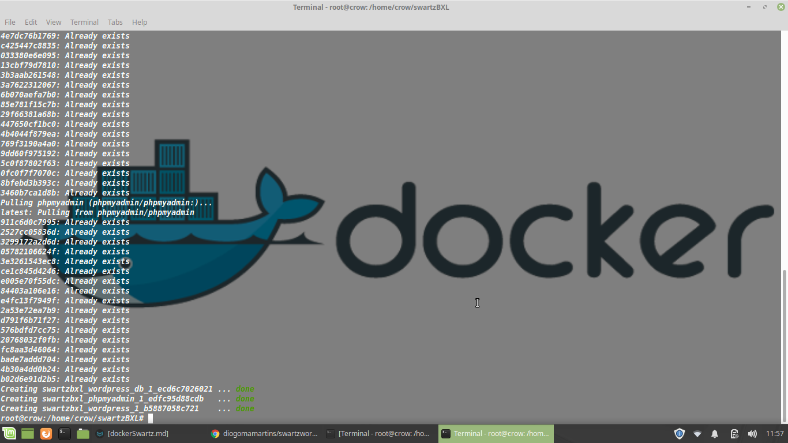
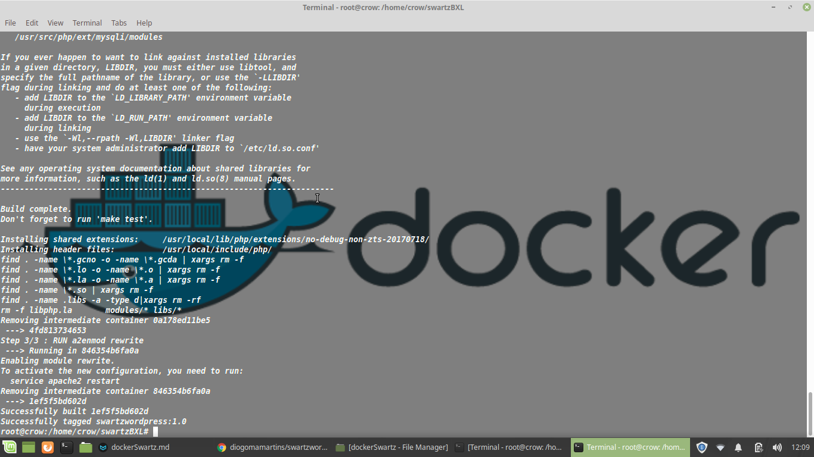
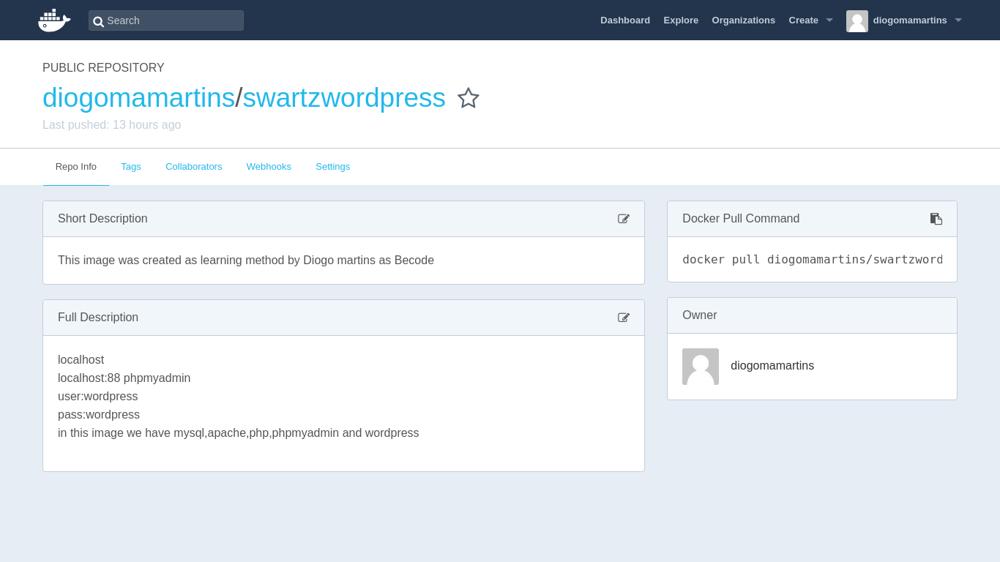

# **Docker and Docker Hub**
==================================

#### How to install Docker?

##### Linux:
-------------------

  *`$sudo su apt-get install docker.io -y | yum install docker.io -y`*

##### Remove:

  `*$sudo su apt-get remove docker docker-engine docker.io*`


##### Docker Compose:

```
sudo curl -L "https://github.com/docker/compose/releases/download/1.23.1/docker-compose-$(uname -s)-$(uname -m)" -o /usr/local/bin/docker-compose
```


##### MacOS:

##### [Download Docker:](https://store.docker.com/editions/community/docker-ce-desktop-mac)

###### Install it:

***Double-click Docker.dmg to start the install process.***


##### Microsoft:

[ Download from Docker Store](https://store.docker.com/editions/community/docker-ce-desktop-windows)


#### Create your account in Docker Hub:

[Click here to subscribe](https://hub.docker.com/)


---

# Let's create "build" our first Image :)


#### Let's start by creating two  folders:

`*mkdir -p swartzBXL/www  *`


##### Now we have to enter the folder and create two files:

`*cd swartzBXL`*

*`touch docker-compose.yml Dockerfile`*


#### It's time to get your hands dirty :c

**Let's modify the fille Dockerfile:**

`~~FROM php:7.2-apache~~`

`~~RUN docker-php-ext-install mysqli~~`

`~~RUN a2enm~~od rewrite`

###### Save


#### Now let's modify  docker-compose.yml:

`version: '3.3'

services:
   wordpress_db:
     image: mysql:5.7
     volumes:

       - db_data:/var/lib/mysql
     restart: always
     environment:
       MYSQL_ROOT_PASSWORD: myrootpass
       MYSQL_DATABASE: wordpress
       MYSQL_USER: wordpress
       MYSQL_PASSWORD: wordpress

   wordpress:
     depends_on:

       - wordpress_db
     image: wordpress:latest
     ports:
       - "80:80"
       - "443:443"
     restart: always
     environment:
       WORDPRESS_DB_HOST: wordpress_db:3306
       WORDPRESS_DB_USER: wordpress
       WORDPRESS_DB_PASSWORD: wordpress

   phpmyadmin:
    depends_on:

      - wordpress_db
    image: phpmyadmin/phpmyadmin
    restart: always
    ports:
      - 88:80
    environment:
      PMA_HOST: wordpress_db:3306
      MYSQL_ROOT_PASSWORD: myrootpass

volumes:
    db_data:


###### ***Save***

---

## Let's compose our image and launch

#### Open Terminal as root:

`sudo su`

#### Go to your directory swartzBXL:

`cd swartzBXL`

##### Now run:

`docker-compose -f "docker-compose.yml" up -d`


##### Now run: localhost:88  localhost/wordpress_db:3306


#### If you want Build Image:

`docker build -t swartzwordpress:1.0 .`

###### -t name:version  and directory if you are in the folder just .



#### Tag your image:

`docker tag swartzwordpress:1.0 diogomamartins/swartzwordpress:1.0`

###### docker tag name of the image build it :version name of user docker hub /image:version

#### Push your Image to Docker Hub:


*`docker login`*

`docker push diogomamartins/swartzwordpress:1.0`

###### `docker push --name of user on Docker hub/name of image:version`




#### Don't forget to stop docker compose:

`docker-compose stop`

##### Run this command for see if you have one container running:

`docker ps`

##### If you have run:

`docker stop <id container>`


